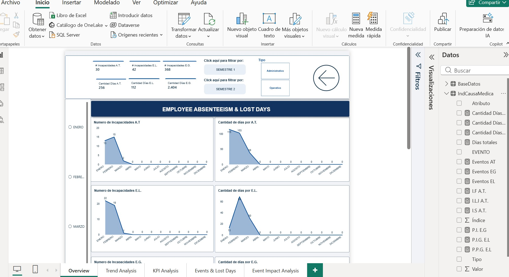
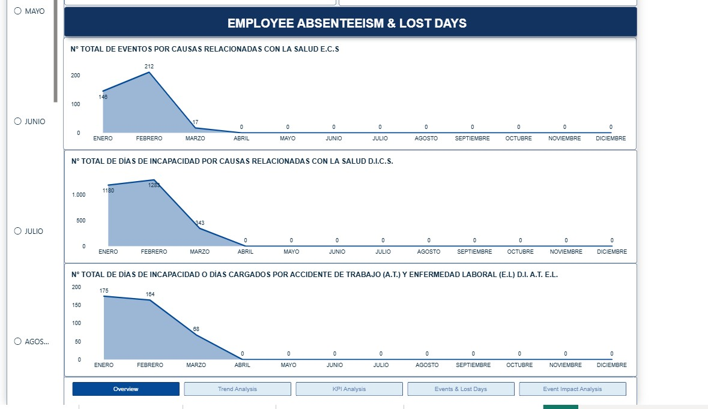

# Employee Absenteeism & Lost Days Dashboard

## 📊 Project Overview

Interactive Business Intelligence dashboard developed in Power BI to analyze employee absenteeism events and lost days over time.

The project transforms structured Excel data into an interactive reporting solution, allowing users to explore key performance indicators, trends, event categories and lost days through dynamic filters.

> **Note:** This portfolio version uses anonymized and synthetic data. The original business data has not been published.

---

## 🎯 Business Objective

The main objective is to provide a centralized and interactive view of absenteeism indicators to support data-driven analysis and monitoring.

The dashboard allows users to:

* Monitor total absenteeism events.
* Analyze lost days associated with different event categories.
* Identify monthly trends.
* Compare different employee types.
* Analyze semester-level performance.
* Explore the relationship between events and lost days.

---

## 🛠️ Tools & Technologies

* **Power BI**
* **Power Query**
* **DAX**
* **Microsoft Excel**
* Data Modeling
* Data Visualization
* Business Intelligence

---

## 🔄 Data Preparation

The original data source was an Excel workbook.

Power Query was used to prepare and transform the dataset before loading it into the Power BI data model.

Main transformation steps included:

* Data type transformation.
* Handling missing and invalid values.
* Data cleaning and standardization.
* Column organization.
* Creation of analytical categories.
* Reshaping data using unpivot transformations.
* Preparation of monthly and semester-level indicators.

---

## 📐 DAX & KPI Development

Several DAX measures were created to calculate and monitor key indicators.

Examples include:

* Total absenteeism events.
* Total lost days.
* Monthly event counts.
* Lost days by event category.
* Semester-level indicators.
* Dynamic metrics based on selected filters.

The measures were designed to interact with the dashboard's filtering and navigation features.

---

## 📊 Dashboard Features

The report contains five analytical sections:

### Overview

Provides a high-level view of the main absenteeism indicators.

### Trend Analysis

Shows the evolution of absenteeism events and lost days across the months.

### KPI Analysis

Provides a detailed view of the main performance indicators.

### Events & Lost Days

Analyzes the relationship between absenteeism events and the number of lost days.

### Event Impact Analysis

Provides additional analysis of the impact associated with different event categories.

---

## 🎛️ Interactive Features

The dashboard includes interactive controls for:

* Semester selection.
* Employee type filtering.
* Monthly analysis.
* Dynamic KPI updates.
* Navigation between analytical sections.

---

## 🧩 Skills Demonstrated

This project demonstrates practical experience in:

* Power BI dashboard development.
* Power Query transformations.
* DAX measure creation.
* Data modeling.
* KPI design.
* Interactive reporting.
* Data visualization.
* Business-oriented data analysis.

---

## 📈 Key Takeaways

The project demonstrates the complete BI workflow:

**Excel → Power Query → Data Model → DAX → Power BI Dashboard**

It showcases how structured data can be transformed into an interactive analytical solution designed to support business decision-making.

---

## 🔒 Data Privacy

This repository does not contain confidential organizational information.

The portfolio version uses synthetic/anonymized data and has been adapted specifically for demonstration purposes.
